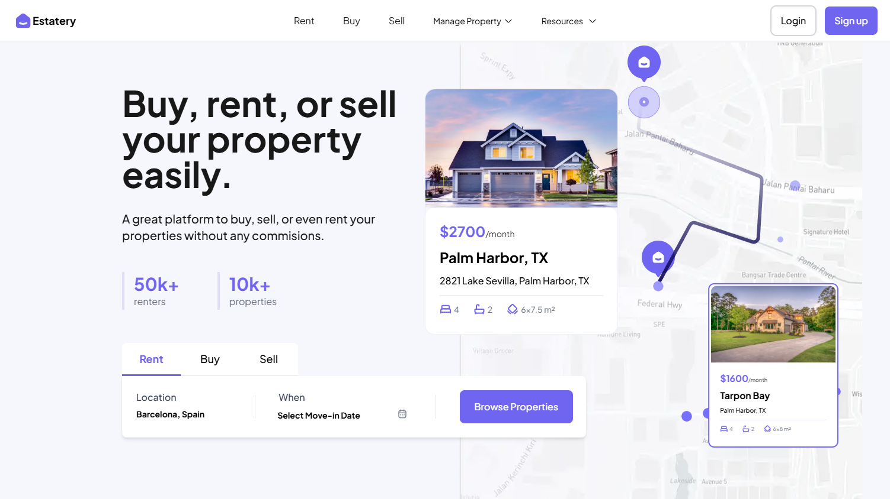
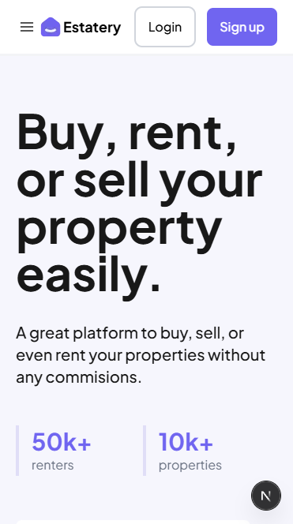
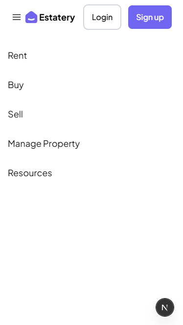
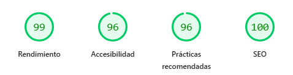

# Portal Inmobiliario – Challenge Frontend Profesional

🔗 **[Ver Deploy en Vercel](https://frontend-challenge-portal-inmobilia.vercel.app/)**

Este proyecto es la respuesta a un challenge de frontend para un portal inmobiliario, diseñado específicamente para demostrar experiencia y dominio de los requisitos clave del puesto.

---

## 🚀 Stack Principal y Plus

- **React**
- **Next.js** (componentización)
- **Tailwind CSS** (design system, consistencia visual)
- **GitHub** (flujo profesional: ramas, PRs, convenciones de commits)
- **TypeScript** (tipado seguro y robusto)
- **Testing:** Jest, React Testing Library (calidad y confianza)
- **CI/CD:** GitHub Actions + Vercel (deploy automático, feedback rápido)

---

## 💡 ¿Por qué este enfoque?

La consigna pedía implementar una de las dos pantallas principales del portal inmobiliario usando Next.js y Tailwind.  
Este proyecto va más allá: no solo cumple la consigna, sino que evidencia el dominio de los siguientes puntos clave del puesto:

---

## 🧩 Módulos y Features Clave

- **Home y Listados:**  
  Pantalla principal, búsqueda por ciudad y rango de disponibilidad.
- **Mapa Interactivo:**  
  Visualización de propiedades mockeadas, enfatizando según el término de búsqueda, optimizado para performance y accesibilidad.
- **Ficha de Propiedad:**  
  (Estructura preparada para fácil extensión).
- **Buenas prácticas:**  
  (Componentización y validación de formularios).
- **Simulación de backend:**  
  Mock de datos y simulación asíncrona.
- **Manejo de errores en el formulario:**
  No se puede buscar Casas en renta sin rango de fechas
  No se puede acceder a la funcion Vender
- **Implementacion de esqueletons para estados de carga:**
- **Implementacion de animaciónes y transiciones:**
---

## 🛠️ Buenas Prácticas y Conocimientos Demostrados

- **Diseño Responsive Fiel al Original:**
  Implementación responsive que respeta el diseño en todos los dispositivos, demostrando atención al detalle más allá de los requisitos explícitos.
- **Animaciónes**  
  Animaciónes de entrada y card con tilt.
- **Buenas prácticas y atención al detalle:**  
  Componentización, variables de color, tipografía y componentes reutilizables.
- **Testing:**  
  Pruebas unitarias y de integración para lógica y UI.
- **CI/CD:**  
  Workflows automáticos para lint, build, test y deploy en Vercel.
- **SEO:**  
  Metadatos, sitemaps, etiquetas accesibles y semantic HTML.
- **SSR:**  
  Uso de server-side rendering.
- **Performance:**  
  Lazy loading, optimización de imágenes y Core Web Vitals monitoreados con PageSpeed Insights.
- **Análisis del bundle:**  
  Análisis del bundle con bundle-analyzer para optimizar con base en datos.

---

## 🖼️ Screenshots y Resultados

### Vista de Escritorio


### Vistas Móviles

| Vista Principal | Menú Abierto |
| :---: | :---: |
|  |  |

### Reporte de PageSpeed Insights


---

## 🏗️ Setup y Ejecución

```bash
git clone https://github.com/AgustinNRios/frontend-challenge-portal-inmobiliario.git
cd frontend-challenge-portal-inmobiliario
npm install
npm run dev
```

---

## ✨ Reflexión Profesional

Cada decisión en este proyecto está orientada a la calidad, la escalabilidad y la experiencia de usuario.  
La implementación es pulcra, modular y lista para crecer:  
- El código es fácil de mantener y escalar.
- El diseño es consistente y fiel.
- El flujo de trabajo es el de un equipo profesional.

---

## 🏁 Conclusión

Este challenge no solo cumple con la consigna, sino que demuestra que poseo el stack tecnológico, los conocimientos y las aptitudes que el puesto requiere.  

**¡Gracias por la oportunidad! Estoy listo para aportar valor y calidad a tu equipo.**
